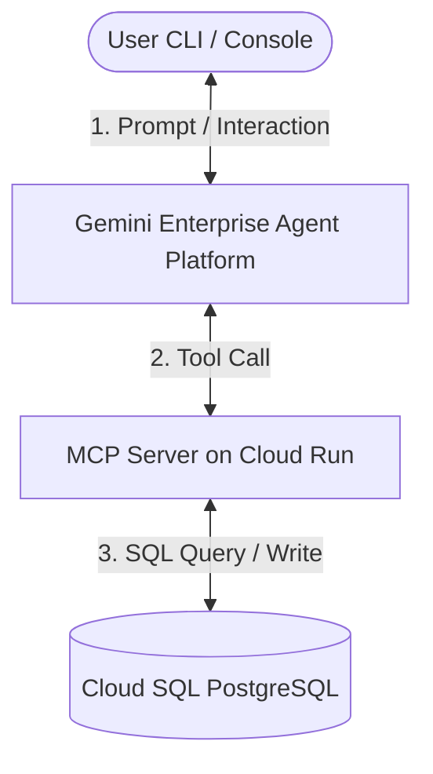

# Gemini Enterprise Agent Platform (GEAP) Warehouse Workshop

This workshop demonstrates the capabilities of the **Gemini Enterprise Agent Platform (GEAP)**. It builds a stateful **Warehouse Management Agent** that queries a Cloud SQL database through an MCP (Model Context Protocol) server running on Cloud Run, reasons over customer requests, and performs transactions.

### Key Capabilities Demoed
* **Native MCP Server Integration:** Connecting remote Model Context Protocol (MCP) servers securely to a cloud-managed agent.
* **FastMCP Tool Generation:** Effortlessly generating standardized MCP schemas from simple, type-hinted Python functions.
* **Stateful Tool Calling:** Demonstrating an agent's ability to reason, invoke tools sequentially, evaluate responses, and take conditional actions (e.g., verifying stock before allowing an order).
* **Local Emulation:** Rapidly developing and testing agents locally without the overhead of cloud deployment cycles.
* **Agent Provisioning:** Utilizing Vertex AI Agent Engine to create persistent, cloud-managed agents.

---

## Architecture Overview



---

## Prerequisites

If you are running this workshop locally, ensure you have the Google Cloud CLI (`gcloud`) installed and authenticated:
```bash
gcloud auth login
gcloud auth application-default login
```

Set the project you will use for this workshop:
```bash
export GOOGLE_CLOUD_PROJECT="YOUR_PROJECT_ID"
gcloud config set project $GOOGLE_CLOUD_PROJECT
```

> [!TIP]
> **Cloud Shell Users**: If you are using **Google Cloud Shell**, you can skip running `gcloud auth login` or `gcloud auth application-default login` as you are already authenticated. You can also skip setting the project if Cloud Shell is already configured to your target project (verify by running `gcloud config get project`).

---

## GCP Project & IAM Setup

If you are using a new GCP project, you must enable the required Google Cloud APIs and ensure your user account has the appropriate permissions.

### 1. Required IAM Roles
The user account running this workshop requires the following IAM roles on the project:
* **Project IAM Admin** (`roles/resourcemanager.projectIamAdmin`) - to configure Service Account permissions.
* **Cloud Run Admin** (`roles/run.admin`) - to deploy the MCP server.
* **Cloud SQL Admin** (`roles/cloudsql.admin`) - to create and manage the PostgreSQL database.
* **Vertex AI Administrator** (`roles/aiplatform.admin`) - to create and run agents.
* **Service Usage Admin** (`roles/serviceusage.serviceUsageAdmin`) - to enable Google Cloud APIs.
* **Storage Admin** (`roles/storage.admin`) - to create storage buckets for container builds.
* **Artifact Registry Administrator** (`roles/artifactregistry.admin`) - to store the built container images.

> [!NOTE]
> If you have the **Owner** (`roles/owner`) role on the project, you already have all the necessary permissions.

### 2. Enable Required APIs
Run the following command to enable all the necessary APIs:
```bash
gcloud services enable \
    sqladmin.googleapis.com \
    run.googleapis.com \
    artifactregistry.googleapis.com \
    aiplatform.googleapis.com \
    agentregistry.googleapis.com \
    cloudbuild.googleapis.com \
    serviceusage.googleapis.com
```

---

## 1. Setup Virtual Environment & Install Dependencies

> **Business Goal**: Establish a clean, isolated Python runtime environment to ensure consistent package dependencies, preventing conflicts between workshop libraries and existing system-level packages.

Create and activate a python virtual environment, then install dependencies:
```bash
python3 -m venv venv
source venv/bin/activate
pip install -r requirements.txt
```

---

## 2. Step 1: Create Cloud SQL DB & Seed Data

> **Business Goal**: Establish a secure, managed Cloud SQL database to act as our system of record, holding product inventories and customer orders. Prefixing the resources with your username ensures isolation so multiple users can run the workshop simultaneously in the same Google Cloud project.

1. Run the database creation script:
   ```bash
   bash scripts/create_db.sh
   ```
   
   > [!NOTE]
   > Creating a new Cloud SQL instance can take **5 to 10 minutes** to provision on Google Cloud. Subsequent runs of this script will be instant as it skips creation if the instance already exists.

### What is Executed:
* **Instance Creation:** Provisions a Cloud SQL PostgreSQL v15 database instance named `${USER}-warehouse-db` in region `us-central1` utilizing the lightweight `db-f1-micro` tier.
* **Database Setup:** Checks for and creates a PostgreSQL database called `warehouse`.
* **Table Creation & Seeding:** Triggers `scripts/setup_db.py` to establish connection using the Cloud SQL Python Connector and schema seeding:
  * Drops any pre-existing tables to ensure a clean state.
  * Creates an `inventory` table and an `orders` table.
  * Seeds the inventory with five futuristic warehouse products (e.g., *Quantum Compactor*, *Antigravity Boots*).

### Key Lines in Code:
* **Cloud SQL Instance Creation (`scripts/create_db.sh`):**
  ```bash
  gcloud sql instances create "${USER}-warehouse-db" \
      --database-version=POSTGRES_15 \
      --tier=db-f1-micro \
      --region="us-central1" \
      --root-password="super-secret-password" \
      --quiet
  ```
* **Database Seeding and Python Connection (`scripts/setup_db.py`):**
  ```python
  from google.cloud.sql.connector import Connector, IPTypes
  import getpass
  username = getpass.getuser()
  connector = Connector()

  def getconn():
      return connector.connect(
          f"{project}:us-central1:{username}-warehouse-db",
          "pg8000",
          user="postgres",
          password="super-secret-password",
          db="warehouse",
          ip_type=IPTypes.PUBLIC
      )

  engine = sqlalchemy.create_engine("postgresql+pg8000://", creator=getconn)
  ```

---

## 3. Step 2: Deploy & Expose the MCP Server on Cloud Run

> **Business Goal**: Package the database access logic into a standardized, web-accessible Model Context Protocol (MCP) server running on Cloud Run, and enroll the tools (such as `list_inventory` and `create_order`) into the Google Agent Registry. This establishes a secure interface enabling LLM agents to safely interact with database records.

1. Build and deploy the FastMCP server code to Cloud Run, and set up database connection permissions:
   ```bash
   bash scripts/deploy_mcp_server.sh
   ```
   Save the output `MCP_SERVER_URL` in your terminal:
   ```bash
   export MCP_SERVER_URL="https://${USER}-warehouse-mcp-server-xxxx-uc.a.run.app/sse"
   ```

2. Register the deployed service in the Agent Registry:
   ```bash
   python3 scripts/register_mcp_server.py
   ```

### What is Executed:
* **IAM Grants:** Finds your project number and grants the default Compute Engine service account (`{PROJECT_NUMBER}-compute@developer.gserviceaccount.com`) several critical roles (`roles/cloudsql.client`, `roles/storage.objectViewer`, `roles/logging.logWriter`, `roles/artifactregistry.writer`) so Cloud Build can read the sources, compile, and push the Docker container successfully.
* **Cloud Run Deployment:** Deploys `${USER}-warehouse-mcp-server` from the local `mcp_server` directory. It configures the Cloud Run instance to mount the Cloud SQL connection (`add-cloudsql-instances`) and sets connection variables (`DB_USER`, `DB_PASS`, `DB_NAME`, `INSTANCE_CONNECTION_NAME`).
* **Agent Registry Enrollment:** Executes `register_mcp_server.py` to register the MCP tools schema (e.g., `list_inventory`, `create_order`) with the Google Enterprise Agent Registry.

### Key Lines in Code:
* **IAM Grant Permissions (`scripts/deploy_mcp_server.sh`):**
  ```bash
  gcloud projects add-iam-policy-binding "$GOOGLE_CLOUD_PROJECT" \
      --member="serviceAccount:${SERVICE_ACCOUNT}" \
      --role="roles/storage.objectViewer" --quiet
  ```
* **Cloud Run Server Deployment (`scripts/deploy_mcp_server.sh`):**
  ```bash
  gcloud run deploy "${USER}-warehouse-mcp-server" \
      --source mcp_server \
      --region us-central1 \
      --add-cloudsql-instances "${GOOGLE_CLOUD_PROJECT}:us-central1:${USER}-warehouse-db" \
      --set-env-vars "DB_USER=postgres,DB_PASS=super-secret-password,DB_NAME=warehouse,INSTANCE_CONNECTION_NAME=${GOOGLE_CLOUD_PROJECT}:us-central1:${USER}-warehouse-db" \
      --allow-unauthenticated --quiet
  ```

---

## 4. Step 3: Run the Warehouse Agent

> **Business Goal**: Implement and execute the core agent loop. Option A lets you test changes rapidly via local emulation, Option B deploys a secure, enterprise-grade cloud-hosted agent, and Option C packages the agent logic into a custom sandbox container using the Vertex AI ADK.

Choose **Option A (Local Emulation - Recommended)** or **Option B (Cloud Managed Agent)** depending on your GCP organizational permissions:

### Option A: Local Agent Emulation (Works out-of-the-box)
In Local Emulation, you bypass cloud-provisioning completely. The **Local Agent Client** runs the conversational and function-calling loop directly on your workstation using the standard Gemini API (`gemini-3.5-flash`), loading tool specifications directly from your deployed Cloud Run MCP server. This is the recommended approach for rapid local development and testing before pushing an agent to production.

```bash
export MCP_SERVER_URL="YOUR_CLOUD_RUN_SSE_URL"
python3 scripts/local_agent.py
```

#### What is Executed:
* **OAuth / OIDC Authentication:** Checks if the target `MCP_SERVER_URL` points to an authenticated `.run.app` service. If so, it requests a secure Google OIDC ID Token for the Cloud Run audience and attaches it as an `Authorization` header, bypassing corporate *Domain Restricted Sharing* restrictions.
* **Tool Mapping:** Fetches the database tool schemas from the MCP server and maps them to standard Gemini `FunctionDeclaration` parameters.
* **Stateful Chat Loop:** Initiates a text loop, passing prompts to Gemini and intercepting requested tool calls, calling the MCP server via SSE, and returning database results back to the model.

#### Key Lines in Code:
* **OIDC Secure Token Retrieval (`scripts/local_agent.py`):**
  ```python
  import google.oauth2.id_token
  from google.auth.transport.requests import Request

  audience = mcp_url.split("/sse")[0]
  token = google.oauth2.id_token.fetch_id_token(Request(), audience)
  headers["Authorization"] = f"Bearer {token}"
  ```
* **Mapping MCP Schema to Gemini Function Declarations (`scripts/local_agent.py`):**
  ```python
  tools_result = await session.list_tools()
  for tool in tools_result.tools:
      fd = genai_types.FunctionDeclaration(
          name=tool.name,
          description=tool.description,
          parameters=tool.inputSchema
      )
      func_declarations.append(fd)
  ```

---

### Option B: Cloud-Managed Agent
You can also create a permanent cloud-managed agent hosted by Vertex AI Agent Engine. Because your Cloud Run MCP server is protected by Google Cloud IAM (Domain Restricted Sharing), the Agent Platform requires valid credentials to connect to it.

```bash
export MCP_SERVER_URL="YOUR_CLOUD_RUN_SSE_URL"
python3 scripts/create_agent.py
python3 scripts/interact_agent.py
```

#### What is Executed:
* **Token Retrieval & Injection:** Dynamically fetches a Google Identity token via `gcloud auth print-identity-token` and injects it into the `headers` field of the `mcp_server` tool definition. This allows Vertex AI Agent Engine to authenticate with the Cloud Run service.
* **Agent Provisioning:** Initiates a call to the Vertex AI Agent Engine (`client.agents.create`) using the base agent model (`antigravity-preview-05-2026`). It registers your Cloud Run MCP server URL and injected headers as a remote toolset.
* **Operation Polling:** It monitors and polls the long-running operation until the agent container is fully ready.

#### Key Lines in Code:
* **Configuring MCP Server Authentication (`scripts/create_agent.py`):**
  ```python
  import getpass
  username = getpass.getuser()
  token = subprocess.check_output(["gcloud", "auth", "print-identity-token"]).decode().strip()
  
  operation = client.agents.create(
      id=f"{username}-warehouse-manager",
      base_agent="antigravity-preview-05-2026",
      system_instruction="You are a warehouse management assistant...",
      tools=[{
          "type": "mcp_server", 
          "name": f"{username}-warehouse-db", 
          "url": mcp_url,
          "headers": {"Authorization": f"Bearer {token}"}
      }],
      timeout=1200 # Overrides default method timeout (20 mins)
  )
  ```

---

### Option C: Vertex AI Reasoning Engine (ADK Python Agent)
Alternatively, you can package the agent inside a custom Python class and deploy it using the **Vertex AI Reasoning Engine (ADK)**. 

Because Reasoning Engine uploads the pickled python code and installs custom requirements in a pre-built container in the cloud, it is a robust alternative when you need direct control over the execution loop and dependency configuration. It is also more resilient during platform-level Tenant Project Pool outages.

#### 1. How to Test the ADK Agent Locally:
You can verify the agent class structure entirely locally (which mocks the remote container execution path):
```bash
source venv/bin/activate
export GOOGLE_CLOUD_PROJECT="YOUR_PROJECT_ID"
python3 scripts/adk_agent.py
```

#### 2. How to Deploy the ADK Agent to Vertex AI:
To deploy the Python class as a remote Reasoning Engine:
```bash
source venv/bin/activate
export GOOGLE_CLOUD_PROJECT="YOUR_PROJECT_ID"
export STAGING_BUCKET="gs://staging.YOUR_PROJECT_ID.appspot.com" # Staging bucket to upload pickle files
python3 scripts/adk_agent.py --deploy
```
This will print the successfully deployed resource name (e.g. `projects/YOUR_PROJECT_NUMBER/locations/us-central1/reasoningEngines/YOUR_ENGINE_ID`).

#### 3. How to Interact with the Deployed Remote Agent:
We provide an interactive CLI client script to query and chat with the deployed remote agent:
```bash
source venv/bin/activate
export GOOGLE_CLOUD_PROJECT="YOUR_PROJECT_ID"
export REASONING_ENGINE_NAME="YOUR_DEPLOYED_REASONING_ENGINE_RESOURCE_NAME"
python3 scripts/interact_adk_agent.py
```

---

## 5. Deploy an Existing LangChain Agent on Agent Platform

> **Business Goal**: Leverage the Vertex AI Agent Platform to deploy and run pre-existing LangChain agent workflows. This allows you to migrate legacy agent logic directly to production-grade managed infrastructure while preserving investments in existing LangChain orchestration code.

Alternatively, you can deploy an existing LangChain agent using the pre-built `vertexai.preview.reasoning_engines.LangchainAgent` template class. Under the hood, this compiles your prompt templates, ChatVertexAI model configs, and Python function tools into a structured LangChain `AgentExecutor`.

We provide a complete sample in `scripts/langchain_agent.py`.

### 1. How to Test the LangChain Agent Locally:
Verify that the model correctly binds your tools and queries locally:
```bash
source venv/bin/activate
export GOOGLE_CLOUD_PROJECT="YOUR_PROJECT_ID"
python3 scripts/langchain_agent.py
```

### 2. How to Deploy the LangChain Agent to Vertex AI:
Deploy the compiled LangChain graph to the cloud under Reasoning Engine:
```bash
source venv/bin/activate
export GOOGLE_CLOUD_PROJECT="YOUR_PROJECT_ID"
export STAGING_BUCKET="gs://staging.YOUR_PROJECT_ID.appspot.com"
python3 scripts/langchain_agent.py --deploy
```
This will output the remote resource name of your deployed LangChain agent:
`Resource Name: projects/YOUR_PROJECT_NUMBER/locations/us-central1/reasoningEngines/YOUR_ENGINE_ID`

### 3. How to Query the Deployed LangChain Agent:
You can load the remote agent by its ID and query it from any script:
```python
import vertexai
from vertexai.preview import reasoning_engines

vertexai.init(project="YOUR_PROJECT_ID", location="us-central1")
agent = reasoning_engines.ReasoningEngine("projects/YOUR_PROJECT_NUMBER/locations/us-central1/reasoningEngines/YOUR_ENGINE_ID")
response = agent.query(input="How many letters are in the word supercalifragilisticexpialidocious?")
print(response)
```

---

## 6. Verify the Workshop Scenarios

> **Business Goal**: Programmatically verify agent integration across various transactional use cases. By testing multi-turn flows (listing stock, querying single items, attempting invalid and valid order submissions), we guarantee the agent behaves reliably and adheres to stock availability rules.

Run the automated verification script to execute the five warehouse scenarios sequentially.

To run verification in **Local Emulation** mode (Option A):
```bash
export MCP_SERVER_URL="YOUR_CLOUD_RUN_SSE_URL"
python3 scripts/verify_workshop.py
```

To run verification using the **Cloud-Managed Agent** (Option B):
```bash
python3 scripts/verify_workshop.py --remote
```

To run verification using the **Reasoning Engine ADK Agent** (Option C):
```bash
python3 scripts/verify_workshop.py --adk "YOUR_DEPLOYED_REASONING_ENGINE_RESOURCE_NAME_OR_ID"
```


### What is Executed:
The script automates five stateful interactions with the agent to verify database transactions and tool calling:
1. **List inventory**: Invokes `list_inventory` on the database to print initial items.
2. **Query product stock**: Checks details of Product ID 3 (Antigravity Boots).
3. **Invalid order (Over-stock)**: Attempts to order 1000 Antigravity Boots. Verification ensures the agent correctly calls `create_order` and rejects it due to insufficient stock.
4. **Valid order**: Orders 5 Antigravity Boots for customer "Verification Test", which decrements the database inventory level.
5. **Re-check stock**: Confirms the database inventory level was updated to 0.

---

---

## 7. Observability, Session & Trajectory Logging

> **Business Goal**: Enable production monitoring, session auditability, and debugging. By recording turn-by-turn session trajectories, capturing step-by-step reasoning maps, inspecting container runtime logs, and exporting OpenTelemetry traces, you can audit agent decisions, monitor latency spikes, and manage resource costs effectively.

### 1. View Sessions & Trajectories via API / CLI

We provide a unified observation script [`scripts/observe_agent.py`](file:///usr/local/google/home/jush/geap-workshop/scripts/observe_agent.py) to inspect session history and execution trajectories for all agent options.

* **Option A (Local Agent Emulation):**
  Inspect locally saved session trajectories:
  ```bash
  # View latest local session trajectory
  python3 scripts/observe_agent.py --local

  # View specific session by ID
  python3 scripts/observe_agent.py --session_id YOUR_SESSION_ID
  ```

* **Option C (Reasoning Engine / ADK Agent):**
  Fetch active session summaries and step-by-step turn trajectories directly via the Reasoning Engine API:
  ```bash
  # List sessions and display the latest session trajectory
  python3 scripts/observe_agent.py --adk YOUR_REASONING_ENGINE_RESOURCE_NAME_OR_ID

  # Query specific session trajectory via API
  python3 scripts/observe_agent.py --adk YOUR_REASONING_ENGINE_RESOURCE_NAME_OR_ID --session_id YOUR_SESSION_ID
  ```

* **Option B (Cloud-Managed Agent):**
  Retrieve the step trace of a specific interaction:
  ```bash
  python3 scripts/observe_agent.py --interaction_id YOUR_INTERACTION_ID
  ```

---

### 2. View Sessions, Trajectories & Traces in Google Cloud Console

You can inspect live session metrics, container logs, and OpenTelemetry trace spans directly within the Google Cloud Console:

* **Vertex AI Reasoning Engine Console:**
  1. Open [Google Cloud Console](https://console.cloud.google.com/).
  2. Select your project ID.
  3. Navigate to **Vertex AI** -> **Reasoning Engine** (or **Agent Engine**).
  4. Click on your deployed agent instance (e.g. `${USER}-warehouse-assistant-adk`).
  5. View deployment details, active endpoints, resource utilization, and session metadata.

* **Container Execution Logs (Cloud Logging):**
  1. Open **Logs Explorer** in Google Cloud Console.
  2. Enter the following query to retrieve stdout/stderr logs from your Reasoning Engine container (replace `ENGINE_ID` with your deployed instance ID):
     ```query
     resource.type="aiplatform.googleapis.com/ReasoningEngine"
     resource.labels.reasoning_engine_id="ENGINE_ID"
     ```
  3. Click **Run query** to inspect real-time tool execution logs, MCP communication steps, and error stack traces.

* **OpenTelemetry Distributed Tracing (Cloud Trace):**
  Deployed Reasoning Engines automatically publish OpenTelemetry spans when environment variables `GOOGLE_CLOUD_AGENT_ENGINE_ENABLE_TELEMETRY="true"` are configured.
  1. Open **Cloud Trace** -> **Trace Explorer** in Google Cloud Console.
  2. Filter by service name `ReasoningEngine` or URI `/query`.
  3. Click on a trace to inspect latency breakdown for Gemini API model generation vs. Cloud Run MCP tool execution.

* **OpenTelemetry Metrics (Cloud Monitoring):**
  1. Open **Metrics Explorer** in Google Cloud Console.
  2. Search for metric domain **Vertex AI Reasoning Engine** (`aiplatform.googleapis.com/ReasoningEngine`).
  3. Select **Request count**, **Request latencies**, or **Container CPU/Memory allocation**.


---

## 8. Connect the Agent to Gemini Enterprise

> **Business Goal**: Final distribution to corporate users. By registering your agent card in the Gemini Enterprise workspace portal, you enable employees to query the warehouse database using natural language directly within their everyday Gemini chat tools.

To expose your custom warehouse manager agent to corporate users in the Gemini Enterprise workspace:
1. Open the Google Cloud Console and navigate to **Gemini Enterprise**.
2. Click on the target **App** you want to attach the agent to.
3. Select **Agents** in the left navigation sidebar.
4. Click **Add agent** and choose the **A2A (Agent-to-Agent)** card.
5. Paste the Agent Card JSON, replacing the `LOCATION` and `RESOURCE_NAME` parameters with your agent's deployment details.
6. Provide OAUTH authorization credentials in the form, and click **Finish**.
7. Users can now query your warehouse DB by writing natural language queries in Gemini!

---

## 9. Interactive Workshop Challenges

> **Business Goal**: Challenge yourself to verify the agent's analytical and reasoning capability by querying it with complex questions. This ensures the agent is not only executing CRUD operations but can also synthesize data and perform calculations when guided by prompts.

Try chatting with your agent using your preferred interface (e.g., `python3 scripts/interact_agent.py` for Option B, or `python3 scripts/interact_adk_agent.py` for Option C), and see if you can solve the following challenges:

### Challenge 1: Inventory Valuation
* **Question**: What is the total monetary value of all Quantum Compactors currently in stock?
<details>
<summary><b>💡 Hint (Sample Prompt)</b></summary>

Ask the agent:
```
What is the total value of all Quantum Compactors in stock? (Hint: Multiply its quantity by price)
```
</details>

### Challenge 2: Peak Valuation Product
* **Question**: Which product in the inventory has the highest unit price, and how many are currently in stock?
<details>
<summary><b>💡 Hint (Sample Prompt)</b></summary>

Ask the agent:
```
Which product has the highest price in the inventory? Tell me its name, price, and current stock level.
```
</details>

---

## 10. Cleanup

> **Business Goal**: De-provision and tear down all deployed resources. By running the cleanup script, you delete all Cloud Run services, Cloud SQL instances, Reasoning Engines, and registry configurations created by your username, ensuring zero ongoing cloud billing charges.

To delete all Cloud SQL instances, Cloud Run services, and Agent registry entries created during the workshop:
```bash
bash scripts/cleanup.sh
```
